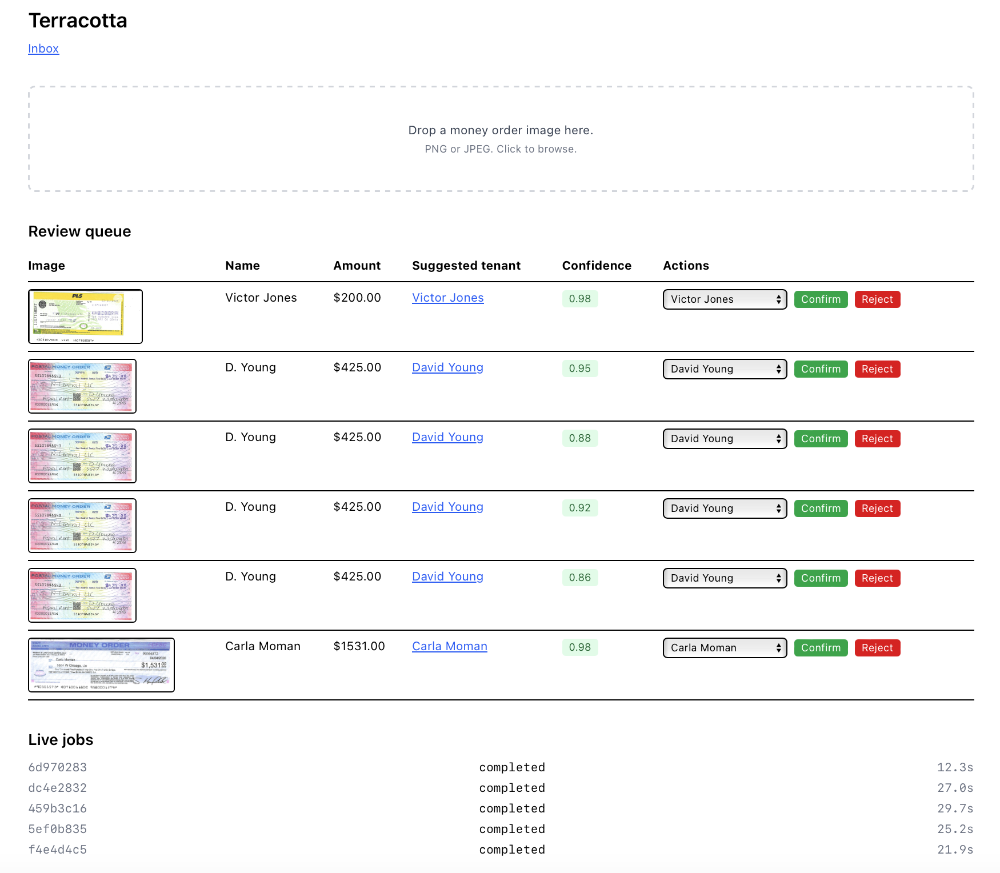

# terracotta-poc

Subsidized housing landlords pay $300+/month for legacy tenant ledger platforms and still spend hours on clerical work — keying in money orders, logging receipts, matching HAP deposits. This is one slice of Terracotta, a system I'm building to replace that work. Claude Opus 4.7 reads the money order, the system finds the tenant, Claude reasons about the match, and a human confirms exceptions. Every correction makes the next scan smarter.

**[Live demo →](https://terracotta-poc.vercel.app)**



Next.js 16+ · TypeScript · Tailwind · Supabase · Prisma · Claude Opus 4.7 · Vercel. Built with Claude Code.

## The loop

1. Landlord drops a money order image on the home page.
2. Claude Opus 4.7 extracts fields (purchaser, amount, memo, serial, issuer) with strict tool use.
3. System finds candidate tenants — alias lookup first, then fuzzy name match, plus rent-amount match.
4. Second Claude call reasons about the best match with adaptive thinking at `xhigh` effort.
5. Confidence ≥ 0.85 → review queue; 0.6–0.84 → review queue with warning; < 0.6 → inbox. Every human correction writes a tenant alias, so the next scan of the same misspelling auto-routes.

## Why Claude Opus 4.7

Terracotta isn't OCR glued to a database. Opus 4.7 first does high-resolution visual extraction from the money order, then a second adaptive-thinking reasoning pass decides which tenant the payment belongs to — weighing name similarity (including misspellings, initials, married names), amount alignment with rent owed, memo hints like unit numbers, and ledger context like last payment date. The workflow is built around strict tool use and an auditable state machine, so Claude is not just generating text — it's driving an agent loop with structured outputs, confidence-based routing, and human review when uncertainty is high.

- **Adaptive thinking with `xhigh` effort** on the tenant-matching reasoning step. Adaptive thinking is the only supported thinking mode on Opus 4.7, and `xhigh` is the recommended effort level for agentic work.
- **Strict tool use (`strict: true`)** on both the extraction and decision tools. Guarantees schema-valid tool inputs via grammar-constrained decoding — no retries, no JSON parsing failures.
- **High-resolution vision** preserved end-to-end. Opus 4.7 supports up to 2576px images; we deliberately skip downsampling because serial numbers, handwriting, and memo lines depend on fine detail.
- **Model-specific prompt engineering.** Opus 4.7 follows instructions more literally than 4.6 and is incompatible with forced `tool_choice` when thinking is on. The reasoning call uses `tool_choice: auto` with explicit "you MUST use the decide_match tool" instructions, plus `stop_reason`-first fallback handling for truncation and refusals.
- **Alias learning loop.** Every human correction writes to a `tenant_aliases` table, so the second scan of a misspelled name auto-routes. The system compounds accuracy over time without schema changes — this is the "gets smarter the more you use it" property, powered by Claude's reasoning plus a lightweight learning surface.
- **Auditable agent loop.** A `jobs` table with a step state machine (extracting → matching → reasoning → routing), end-to-end `request_id` propagation, and distinct operational categories for `scan_no_match` vs `scan_refusal` vs `scan_low_confidence`. Refusals are handled as a first-class operational signal, not swept under a generic failure bucket.

Built with Claude Code to automate work my father still does by hand across his 134-unit Section 8 portfolio.

## Built with Claude Code

Built in a single focused 6-hour hackathon-style session, the POC moved through 9 gated phases from scaffold to live production deploy, following a written build spec (`docs/BUILD_SPEC.md`). Each phase had explicit entry criteria and ended with a manual gate test against a live Supabase DB, verified in Prisma Studio and in the browser. Every file write was diff-first and reviewed before commit. The git history has one logical commit per phase, giving clean rollback points.

## Run locally

Create a `.env.local` with:

- `ANTHROPIC_API_KEY`
- `DATABASE_URL` — Supabase pooled URL (port 6543), suffixed with `?pgbouncer=true&connection_limit=1`
- `DIRECT_DATABASE_URL` — Supabase direct or session-pooler URL (port 5432)

Then:

```
npm install
npx prisma migrate dev
npx prisma db seed
npm run dev
```
